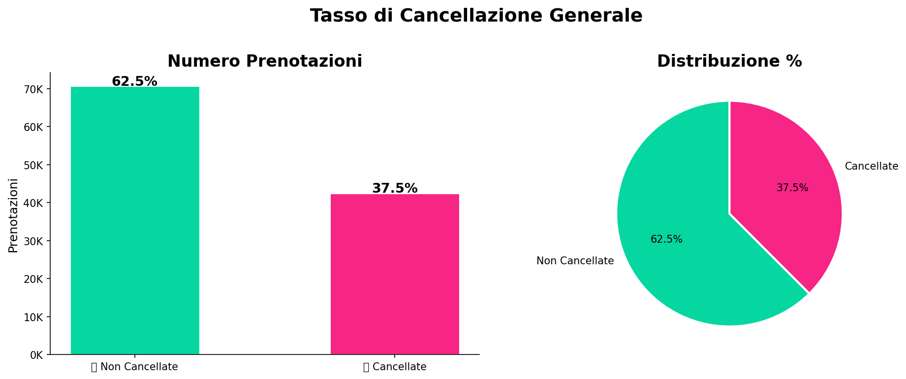
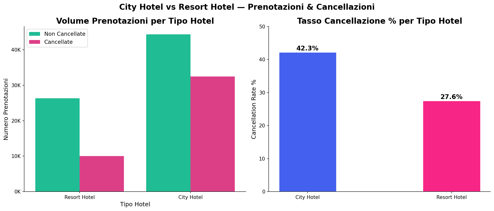
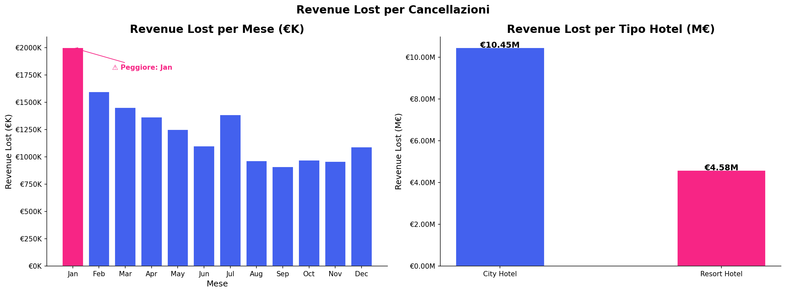
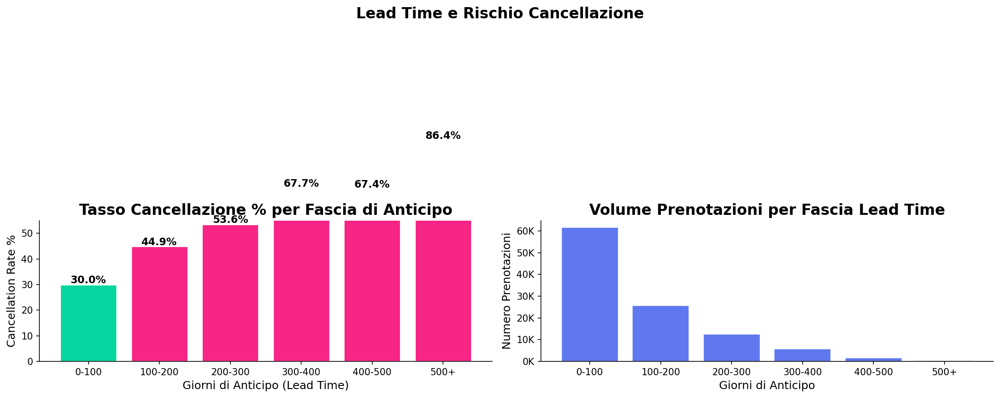
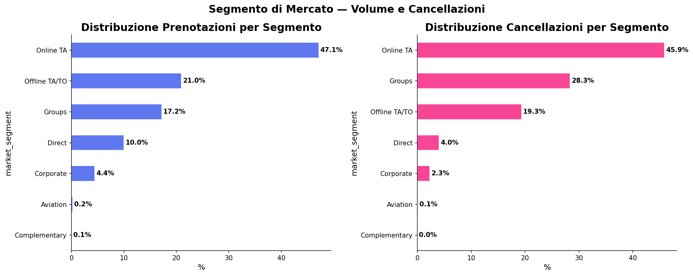

# Hotel Booking Cancellation & Revenue Analysis 
## 🚀 Live Interactive Dashboard

👉 **[View the Interactive Dashboard](https://adamojacoubo-afk.github.io/Hotel-booking-cancellation-revenue-analysis/dashboard.html)**

> Fully interactive dashboard built in HTML/CSS/JS — filter by year and hotel type, explore ADR trends, cancellation patterns, market segments and country analysis.
## Objective
This project analyzes hotel booking data to identify cancellation patterns and estimate the impact on potential revenue.

The goal is to support Revenue Management decisions using data-driven insights.

---

## Dataset
- Source: Kaggle – Hotel Booking Demand Dataset
- Period: 2015–2017
- Hotels: City Hotel & Resort Hotel
- Observations: 119,390 bookings

---

## Key Business Questions
- What is the overall cancellation rate?
- Which hotel type has higher cancellation risk?
- How does lead time affect cancellations?
- What is the impact of cancellations on revenue?
- Which segments generate more cancellations?
## Sample Visual Insights

### Cancellation Rate

### City vs Resort Comparison

### Revenue Lost

---
### Lead Time Analysis

### Market Segment Analysis

## Tools & Technologies
- Python
- Pandas
- NumPy
- Matplotlib
- Seaborn

---

## 🔍 Key Business Insights

- The overall cancellation rate is approximately **37.5%**, meaning that nearly 1 out of 3 bookings does not materialize, creating a significant gap between forecasted and realized revenue.
- The **City Hotel** shows a structurally higher cancellation rate compared to the Resort Hotel, indicating a higher exposure to demand volatility and last-minute booking behavior.
- Bookings with **long lead times** are significantly more likely to cancel, increasing forecast uncertainty and reducing revenue reliability.
- Specific **market segments and distribution channels** (e.g. OTA) contribute disproportionately to cancellations, highlighting a segmentation imbalance.
- Cancelled bookings represent substantial **revenue leakage**, impacting both ADR performance and occupancy optimization.

## 💰 Revenue Impact

High cancellation levels lead to:
- Revenue dilution (unsold rooms or last-minute discounting)
- Forecast inaccuracy
- Operational inefficiencies

## 🎯 Revenue Management Recommendations

- Implement **stricter cancellation and deposit policies** for high-risk segments and long lead-time bookings.
- Introduce **non-refundable and advance purchase rates** to secure early revenue.
- Monitor **booking pace and lead time behavior** daily, integrating them into forecasting models.
- Apply **dynamic pricing strategies** to protect ADR against cancellation risk.
- Shift from general forecasting to **segment-based demand forecasting**, improving accuracy and pricing decisions.## Key Insights

- Cancellation rate is approximately **37.5%**, meaning 1 out of 3 bookings is lost.
- City Hotel shows a higher cancellation rate compared to Resort Hotel.
- Long lead time bookings are more likely to cancel.
- Certain market segments contribute more to cancellations.
- Cancelled bookings represent significant **revenue lost**.

## Project Structure

- `EDA_Hotel_Booking_PROFESSIONAL.ipynb` → Full analysis
- `images/` → Charts and visual insights

## Author

This project was developed as part of my portfolio for Junior Revenue Analyst / Revenue Management roles.
